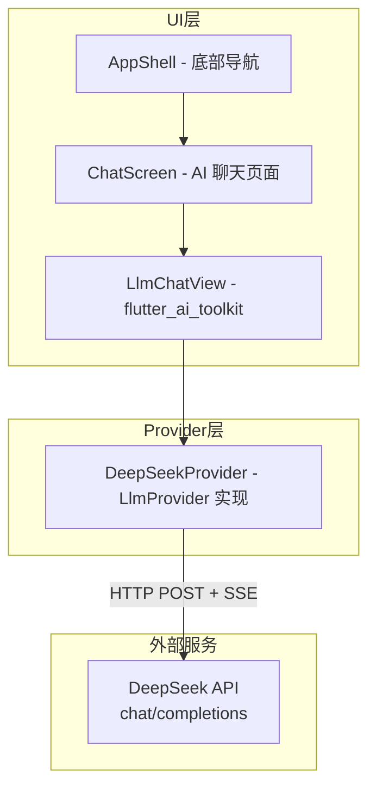
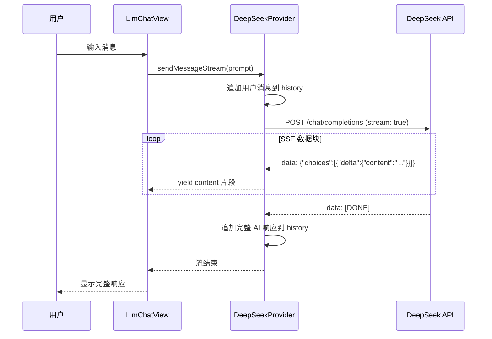

# 设计文档：AI Agent 聊天功能

## 概述

本设计将 Flutter 电商应用中的搜索标签页（Search Tab）替换为 AI Agent 聊天页面。核心工作包括：

1. 实现自定义 `DeepSeekProvider`，通过 HTTP SSE 流式调用 DeepSeek API（OpenAI 兼容格式）
2. 创建 `ChatScreen` 页面，集成 `flutter_ai_toolkit` 的 `LlmChatView` 组件
3. 更新底部导航栏和相关常量，清理废弃的搜索代码

整体改动范围较小，主要涉及新增 1 个 Provider 类、1 个 Screen 页面，以及对 `app_shell.dart`、`constants.dart`、`pubspec.yaml` 的修改。

## 架构

### 整体架构图



### 数据流



## 组件与接口

### 1. DeepSeekProvider（`lib/services/deepseek_provider.dart`）

自定义 `LlmProvider` 实现，负责与 DeepSeek API 通信。

**继承关系：**
- `class DeepSeekProvider extends ChangeNotifier implements LlmProvider`

**构造函数：**
```dart
DeepSeekProvider({
  String? apiKey,
  String model = 'deepseek-chat',
  String? systemPrompt,
})
```

- `apiKey`：可选，默认从 `String.fromEnvironment('DEEPSEEK_API_KEY')` 读取。若为空则抛出 `AssertionError`
- `model`：模型名称，默认 `deepseek-chat`
- `systemPrompt`：可选的系统提示词，用于设定 AI 角色

**核心接口实现：**

| 方法/属性 | 签名 | 说明 |
|---|---|---|
| `generateStream` | `Stream<String> generateStream(String prompt, {Iterable<Attachment> attachments})` | 发送单条 prompt（不含历史），返回流式响应 |
| `sendMessageStream` | `Stream<String> sendMessageStream(String prompt, {Iterable<Attachment> attachments})` | 追加用户消息到历史，发送完整对话历史，返回流式响应，完成后追加 AI 响应到历史 |
| `history` getter | `Iterable<ChatMessage> get history` | 返回当前对话历史 |
| `history` setter | `set history(Iterable<ChatMessage> history)` | 设置对话历史并通知监听者 |

**私有方法：**

| 方法 | 说明 |
|---|---|
| `_requestStream(List<Map<String, String>> messages)` | 构建 HTTP 请求，解析 SSE 响应，返回 `Stream<String>` |
| `_buildRequestBody(List<Map<String, String>> messages)` | 构建请求体 JSON |
| `_parseSseLine(String line)` | 解析单行 SSE 数据，提取 `delta.content` |

### 2. ChatScreen（`lib/screens/chat_screen.dart`）

替换原 `SearchScreen` 的 AI 聊天页面。

```dart
class ChatScreen extends StatefulWidget {
  const ChatScreen({super.key});
}
```

**职责：**
- 创建并持有 `DeepSeekProvider` 实例
- 使用 `LlmChatView(provider: _provider)` 作为页面主体
- 在 `dispose` 中释放 Provider 资源
- 包含 AppBar，标题为"AI 助手"

**Widget 树结构：**
```
Scaffold
├── AppBar(title: "AI 助手")
└── body: LlmChatView(provider: _provider)
```

### 3. AppShell 修改（`lib/screens/app_shell.dart`）

**变更点：**
- 导入 `chat_screen.dart` 替换 `search_screen.dart`
- `_screens` 列表中 `SearchScreen()` → `ChatScreen()`
- 底部导航第二项：图标改为 `chat_bubble_outline` / `chat_bubble`，标签改为 `'Chat'`

### 4. 常量更新（`lib/utils/constants.dart`）

- `searchTab` → `chatTab`，值保持 `1`


## 数据模型

### 对话消息格式

`flutter_ai_toolkit` 包内部使用 `ChatMessage` 类型管理对话历史。`DeepSeekProvider` 需要在内部维护对话历史，并在与 API 通信时转换为 DeepSeek API 所需的格式。

**内部对话历史（`_history`）：**
```dart
List<ChatMessage>  // flutter_ai_toolkit 提供的消息类型
```

**API 请求消息格式：**
```dart
// 发送给 DeepSeek API 的消息结构
{
  "role": "system" | "user" | "assistant",
  "content": "消息内容"
}
```

**API 请求体结构：**
```json
{
  "model": "deepseek-chat",
  "messages": [
    {"role": "system", "content": "你是一个电商购物助手..."},
    {"role": "user", "content": "推荐一款手机"},
    {"role": "assistant", "content": "我推荐..."},
    {"role": "user", "content": "有什么优惠吗？"}
  ],
  "stream": true
}
```

**SSE 响应格式：**
```
data: {"id":"chatcmpl-xxx","object":"chat.completion.chunk","choices":[{"index":0,"delta":{"content":"你"},"finish_reason":null}]}

data: {"id":"chatcmpl-xxx","object":"chat.completion.chunk","choices":[{"index":0,"delta":{"content":"好"},"finish_reason":null}]}

data: [DONE]
```

### API 配置

| 配置项 | 值 | 来源 |
|---|---|---|
| 端点 URL | `https://api.deepseek.com/chat/completions` | 硬编码常量 |
| API Key | 运行时传入 | `--dart-define=DEEPSEEK_API_KEY=xxx` |
| 模型名称 | `deepseek-chat` | 构造函数默认值 |
| 请求头 | `Authorization: Bearer <key>`, `Content-Type: application/json` | 硬编码 |
| 流式模式 | `stream: true` | 硬编码 |


## 正确性属性

*正确性属性是指在系统所有有效执行中都应成立的特征或行为——本质上是对系统应做什么的形式化陈述。属性是人类可读规范与机器可验证正确性保证之间的桥梁。*

### 属性 1：空 API Key 抛出错误

*对于任意*空字符串或未设置的 API Key 值，构造 `DeepSeekProvider` 时都应抛出明确的配置错误，且不应创建可用的 Provider 实例。

**验证需求：2.3**

### 属性 2：sendMessageStream 对话历史累积

*对于任意*用户消息序列，每次调用 `sendMessageStream` 后，对话历史应包含该用户消息和对应的 AI 响应，且历史长度应增加 2（一条用户消息 + 一条 AI 响应）。

**验证需求：3.5**

### 属性 3：generateStream 不影响对话历史

*对于任意* prompt 和任意已有对话历史状态，调用 `generateStream` 后，对话历史应保持不变（长度和内容均不变）。

**验证需求：3.6**

### 属性 4：SSE 解析正确提取内容

*对于任意*包含有效 JSON 的 SSE `data:` 行，其中 `choices[0].delta.content` 字段包含任意字符串值，解析函数应准确提取并返回该字符串值。

**验证需求：3.7**

### 属性 5：非 200 状态码产生错误信息

*对于任意*非 200 的 HTTP 状态码，Provider 的流式响应应包含错误信息字符串，而非正常的 AI 响应内容。

**验证需求：3.9**

### 属性 6：对话历史变更触发通知

*对于任意*通过 `sendMessageStream` 或 `history` setter 引起的对话历史变更，所有已注册的监听者都应收到通知。

**验证需求：3.10**

## 错误处理

### API Key 缺失

- **触发条件：** `DEEPSEEK_API_KEY` 环境变量未设置或为空
- **处理方式：** `DeepSeekProvider` 构造函数中抛出 `AssertionError`，附带明确提示信息（如"DEEPSEEK_API_KEY 未配置，请通过 --dart-define 传入"）
- **影响范围：** 应用启动时 ChatScreen 创建 Provider 失败

### HTTP 请求失败

- **触发条件：** API 返回非 200 状态码（如 401 未授权、429 限流、500 服务器错误）
- **处理方式：** 通过 `Stream<String>` 发送错误提示文本（如"请求失败，状态码: 401"），让 `LlmChatView` 将错误信息显示为 AI 回复
- **用户体验：** 用户在聊天界面看到错误提示，可以重新发送消息

### 网络异常

- **触发条件：** 网络不可用、连接超时、DNS 解析失败等
- **处理方式：** 捕获 `Exception`，通过流发送友好的错误提示（如"网络连接失败，请检查网络设置"）
- **用户体验：** 同上，错误信息作为 AI 回复显示

### SSE 解析异常

- **触发条件：** SSE 数据格式异常、JSON 解析失败
- **处理方式：** 跳过无法解析的行，继续处理后续数据。仅在完全无法解析时通过流发送错误信息
- **设计理由：** SSE 流中偶尔出现空行或注释行是正常的，不应中断整个响应

## 测试策略

### 测试框架

- **单元测试：** `flutter_test`（Flutter SDK 内置）
- **属性测试：** 使用 Dart 的属性测试库（如 `glados` 或手动实现基于随机输入的测试循环）
- **每个属性测试最少运行 100 次迭代**

### 单元测试

单元测试聚焦于具体示例、边界情况和集成点：

1. **DeepSeekProvider 构造函数测试**
   - 验证有效 API Key 创建成功
   - 验证空 API Key 抛出错误（需求 2.3）
   - 验证默认模型名称为 `deepseek-chat`（需求 3.4）

2. **SSE 解析测试**
   - 验证正常 `data:` 行解析（需求 3.7）
   - 验证 `data: [DONE]` 终止流（需求 3.8，边界情况）
   - 验证空行和注释行被跳过
   - 验证格式异常的 JSON 被安全处理

3. **请求体构建测试**
   - 验证请求体包含 `stream: true`（需求 3.3）
   - 验证请求头包含正确的 Authorization 和 Content-Type（需求 3.2）

4. **ChatScreen Widget 测试**
   - 验证 AppBar 标题为"AI 助手"（需求 4.4）
   - 验证包含 LlmChatView 组件（需求 4.2）

5. **导航集成测试**
   - 验证底部导航第二项标签为"Chat"（需求 5.1）
   - 验证图标为 chat_bubble 系列（需求 5.2）

### 属性测试

每个属性测试对应设计文档中的一个正确性属性，使用随机生成的输入验证普遍性质：

1. **Feature: ai-agent-chat, Property 1: 空 API Key 抛出错误**
   - 生成随机空白字符串（空串、空格、制表符等），验证全部抛出错误

2. **Feature: ai-agent-chat, Property 2: sendMessageStream 对话历史累积**
   - 生成随机消息序列，模拟 API 响应，验证每次调用后历史长度正确增长

3. **Feature: ai-agent-chat, Property 3: generateStream 不影响对话历史**
   - 生成随机 prompt 和随机初始历史状态，验证调用后历史不变

4. **Feature: ai-agent-chat, Property 4: SSE 解析正确提取内容**
   - 生成随机字符串内容，构造有效 SSE 行，验证解析结果与原始内容一致

5. **Feature: ai-agent-chat, Property 5: 非 200 状态码产生错误信息**
   - 生成随机非 200 状态码（100-599 范围，排除 200），验证流输出包含错误信息

6. **Feature: ai-agent-chat, Property 6: 对话历史变更触发通知**
   - 生成随机消息序列，注册监听者，验证每次历史变更都触发通知回调

### 测试配置要求

- 属性测试每个至少 100 次迭代
- 每个属性测试必须包含注释引用对应的设计属性编号
- 注释格式：`// Feature: ai-agent-chat, Property {N}: {属性标题}`
- 单元测试和属性测试互补：单元测试验证具体场景，属性测试验证普遍规律
