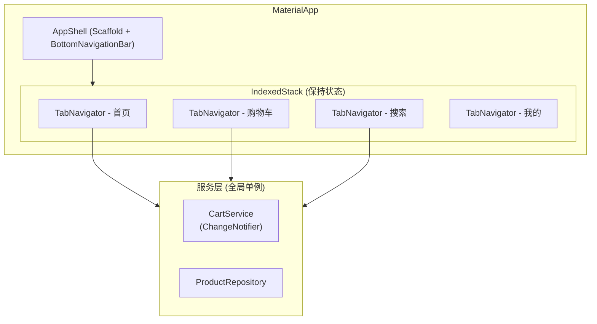
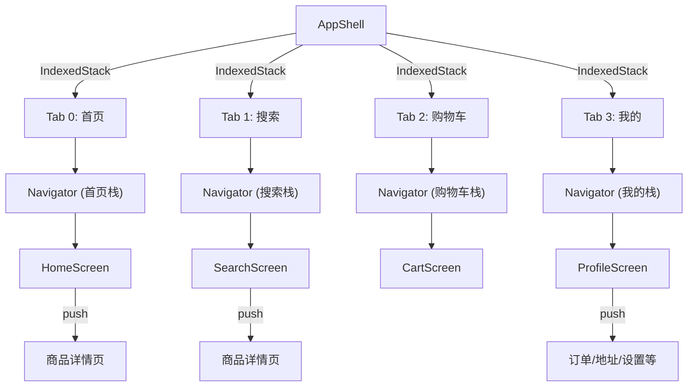
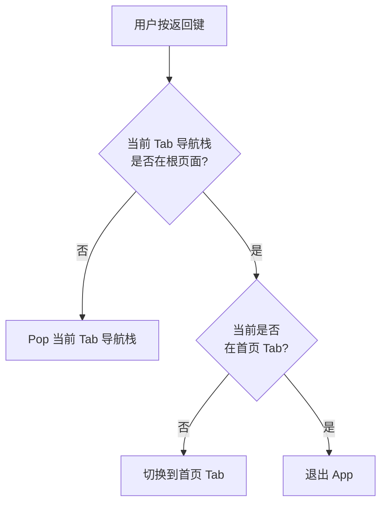
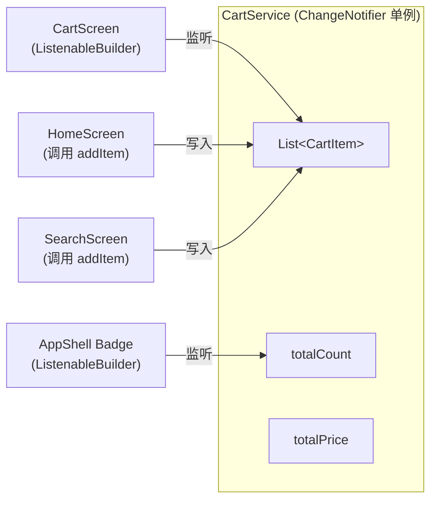

# 技术设计文档：电商 App 架构

## 概述

本设计文档描述了一个基于 BottomNavigationBar 的 4-Tab 电商 App 架构方案。该架构在保留现有组件（Product 模型、ProductCardList、ProductFlag、RecentlyViewedSheet）和 NewRelic 监控集成的基础上，建立清晰的分层结构、Tab 内独立导航栈和统一的状态管理方案。

核心设计决策：
- 使用 `ChangeNotifier` + `ListenableBuilder` 作为状态管理方案，避免引入第三方状态管理库，保持项目轻量
- 使用 `IndexedStack` + 每 Tab 独立 `Navigator` 实现页面状态保持和独立导航栈
- `Cart_Service` 作为全局单例，通过 `ChangeNotifier` 通知多个监听者（角标、购物车页面等）
- `Product_Repository` 封装数据访问层，为后续接入真实 API 预留接口

## 架构

### 整体架构图



### 导航架构图



### 返回按钮处理流程



## 组件与接口

### 目录结构

```
lib/
  main.dart                    # App 入口，NewRelic 初始化，主题配置
  screens/
    app_shell.dart             # App Shell，BottomNavigationBar，IndexedStack
    home_screen.dart           # 首页
    search_screen.dart         # 搜索页
    cart_screen.dart           # 购物车页
    profile_screen.dart        # 我的页面
  widgets/
    tab_navigator.dart         # Tab 内独立导航器
    product_card_list.dart     # (现有) 商品列表卡片
    product_flag.dart          # (现有) 商品标签
    recently_viewed_sheet.dart # (现有) 最近浏览底部弹窗
    cart_item_tile.dart        # 购物车商品行
    search_history_chip.dart   # 搜索历史标签
    promo_banner.dart          # 促销横幅
    category_nav.dart          # 分类导航
    empty_state.dart           # 空状态通用组件
    cart_badge.dart            # 购物车角标
  models/
    product.dart               # (现有) 商品模型
    cart_item.dart             # 购物车项模型
    user_profile.dart          # 用户信息模型
  services/
    cart_service.dart          # 购物车服务 (ChangeNotifier 单例)
    product_repository.dart    # 商品数据仓库
    search_service.dart        # 搜索服务
  utils/
    constants.dart             # 常量定义 (Tab 索引等)
```

### 核心组件接口

#### AppShell

```dart
/// App 顶层容器，管理 BottomNavigationBar 和 Tab 页面切换
class AppShell extends StatefulWidget {
  const AppShell({super.key});
}

class _AppShellState extends State<AppShell> {
  int _currentIndex = 0;
  
  // 每个 Tab 的 Navigator key
  final List<GlobalKey<NavigatorState>> _navigatorKeys = [
    GlobalKey<NavigatorState>(),
    GlobalKey<NavigatorState>(),
    GlobalKey<NavigatorState>(),
    GlobalKey<NavigatorState>(),
  ];
  
  /// 处理 Tab 切换
  void _onTabTapped(int index);
  
  /// 处理系统返回按钮
  Future<bool> _onWillPop();
}
```

#### TabNavigator

```dart
/// 每个 Tab 内的独立导航器
class TabNavigator extends StatelessWidget {
  final GlobalKey<NavigatorState> navigatorKey;
  final Widget child;
  
  const TabNavigator({
    super.key,
    required this.navigatorKey,
    required this.child,
  });
}
```

#### CartService

```dart
/// 购物车服务，全局单例，通过 ChangeNotifier 通知状态变化
class CartService extends ChangeNotifier {
  static final CartService _instance = CartService._internal();
  factory CartService() => _instance;
  CartService._internal();
  
  final List<CartItem> _items = [];
  
  List<CartItem> get items => List.unmodifiable(_items);
  int get totalCount => _items.fold(0, (sum, item) => sum + item.quantity);
  double get totalPrice => _items.fold(0.0, (sum, item) => sum + item.subtotal);
  bool get isEmpty => _items.isEmpty;
  
  /// 添加商品到购物车，若已存在则数量+1
  void addItem(Product product);
  
  /// 更新商品数量，quantity <= 0 时移除
  void updateQuantity(Product product, int quantity);
  
  /// 移除商品
  void removeItem(Product product);
  
  /// 清空购物车
  void clear();
}
```

#### ProductRepository

```dart
/// 商品数据仓库，封装数据获取和缓存逻辑
class ProductRepository {
  /// 获取推荐商品列表
  Future<List<Product>> getRecommendedProducts();
  
  /// 搜索商品
  Future<List<Product>> searchProducts(String query);
  
  /// 获取商品详情
  Future<Product> getProductDetail(String productId);
  
  /// 获取最近浏览商品
  Future<List<Product>> getRecentlyViewed();
}
```

#### SearchService

```dart
/// 搜索服务，管理搜索历史和搜索建议
class SearchService {
  /// 获取搜索建议
  Future<List<String>> getSuggestions(String query);
  
  /// 获取搜索历史
  List<String> getHistory();
  
  /// 添加搜索记录
  void addToHistory(String query);
  
  /// 清除搜索历史
  void clearHistory();
}
```

### 页面组件

#### HomeScreen

```dart
class HomeScreen extends StatefulWidget {
  const HomeScreen({super.key});
}
/// 首页：促销横幅 + 分类导航 + 推荐商品列表 (复用 ProductCardList)
/// 支持下拉刷新 (RefreshIndicator)
/// 通过 ProductRepository 获取数据
/// 集成 RecentlyViewedSheet
```

#### SearchScreen

```dart
class SearchScreen extends StatefulWidget {
  const SearchScreen({super.key});
}
/// 搜索页：搜索框 + 搜索历史 + 搜索建议 + 搜索结果 (复用 ProductCardList)
/// 通过 SearchService 管理搜索逻辑
```

#### CartScreen

```dart
class CartScreen extends StatelessWidget {
  const CartScreen({super.key});
}
/// 购物车页：商品列表 (CartItemTile) + 价格汇总
/// 通过 CartService 管理状态
/// 空状态展示引导页面
```

#### ProfileScreen

```dart
class ProfileScreen extends StatelessWidget {
  const ProfileScreen({super.key});
}
/// 我的页面：用户信息区 + 功能入口列表
/// 未登录时展示登录引导
```


## 数据模型

### 现有模型（保留不变）

#### Product

```dart
class Product {
  final String brand;
  final String title;
  final double rating;
  final int reviewCount;
  final String currentPrice;
  final String? originalPrice;
  final String? flagText;
  final FlagType? flagType;
  final PriceType priceType;
  final String imageUrl;
}

enum FlagType { special, tryIt, saveInCart }
enum PriceType { regular, discount, trial, seeInCart }
```

### 新增模型

#### CartItem

```dart
/// 购物车项，关联 Product 并记录数量
class CartItem {
  final Product product;
  int quantity;
  
  CartItem({required this.product, this.quantity = 1});
  
  /// 小计金额（解析 currentPrice 字符串计算）
  double get subtotal;
  
  /// 基于 product 的标题判断相等性
  @override
  bool operator ==(Object other);
  
  @override
  int get hashCode;
}
```

设计决策：`CartItem` 直接持有 `Product` 引用而非 productId，因为当前阶段没有后端 API，商品数据来自本地。后续接入 API 时可改为 productId + 懒加载。

`subtotal` 需要解析 `currentPrice` 字符串（如 `"$17.84"`）为 double。对于 `PriceType.seeInCart` 类型的商品，小计为 0（需要在购物车中查看价格的特殊逻辑后续处理）。

#### UserProfile

```dart
/// 用户信息模型
class UserProfile {
  final String nickname;
  final String avatarUrl;
  final String memberLevel;
  
  const UserProfile({
    required this.nickname,
    required this.avatarUrl,
    required this.memberLevel,
  });
}
```

### 状态管理方案



设计决策：选择 `ChangeNotifier` + `ListenableBuilder` 而非 Provider/Riverpod/Bloc 的原因：
1. 项目当前规模较小，无需引入第三方状态管理库
2. `ChangeNotifier` 是 Flutter 内置方案，零依赖
3. `ListenableBuilder` (Flutter 3.10+) 提供声明式监听，代码简洁
4. 全局单例模式足以满足购物车跨页面共享的需求
5. 后续如需更复杂的状态管理，可平滑迁移到 Provider（Provider 本身就是基于 ChangeNotifier）

### 主题系统

```dart
ThemeData(
  colorScheme: ColorScheme.fromSeed(seedColor: Colors.deepPurple),
  // 所有 Widget 通过 Theme.of(context).colorScheme 访问颜色
  // 所有 Widget 通过 Theme.of(context).textTheme 访问文字样式
)
```

规则：
- 禁止在 Widget 中硬编码颜色值（现有组件中的硬编码颜色在后续迭代中逐步迁移）
- 新增组件必须使用 `Theme.of(context)` 获取设计 token
- 现有组件（ProductCardList、ProductFlag 等）暂时保留硬编码颜色，避免破坏现有 UI

### 现有组件集成策略

| 组件 | 集成位置 | 集成方式 |
|------|---------|---------|
| Product 模型 | 全局 | 保持不变，CartItem 持有 Product 引用 |
| ProductCardList | HomeScreen、SearchScreen | 直接复用，通过 onAddToCart 回调连接 CartService |
| ProductFlag | 随 ProductCardList 使用 | 无需修改 |
| RecentlyViewedSheet | HomeScreen | 通过按钮或手势触发 `RecentlyViewedSheet.show()` |
| NewRelic 集成 | main.dart | 保留 `runZonedGuarded` 启动方式，将 `home` 改为 `AppShell` |

### main.dart 重构方案

```dart
// 重构后的 main.dart 结构
void main() {
  runZonedGuarded(() async {
    WidgetsFlutterBinding.ensureInitialized();
    FlutterError.onError = NewrelicMobile.onError;
    await NewrelicMobile.instance.startAgent(config);
    runApp(const MyApp());
  }, (error, stackTrace) {
    NewrelicMobile.instance.recordError(error, stackTrace);
  });
}

class MyApp extends StatelessWidget {
  @override
  Widget build(BuildContext context) {
    return MaterialApp(
      title: 'Flutter Demo',
      theme: ThemeData(
        colorScheme: ColorScheme.fromSeed(seedColor: Colors.deepPurple),
      ),
      home: const AppShell(), // 替换原来的 MyHomePage
    );
  }
}
```


## 正确性属性

*属性（Property）是指在系统所有有效执行中都应保持为真的特征或行为——本质上是对系统应做什么的形式化陈述。属性是人类可读规格说明与机器可验证正确性保证之间的桥梁。*

### Property 1: Tab 切换正确更新当前索引

*For any* 有效的 Tab 索引（0-3），点击该 Tab 后，AppShell 的当前选中索引应等于被点击的 Tab 索引。

**Validates: Requirements 1.2**

### Property 2: 购物车角标数量与购物车状态一致

*For any* 非空的购物车状态（包含任意数量的 CartItem），AppShell 中购物车 Tab 的角标数字应等于 `CartService.totalCount`（所有商品数量之和）。

**Validates: Requirements 1.6**

### Property 3: Tab 导航栈隔离性

*For any* 两个不同的 Tab，在其中一个 Tab 内执行 push 操作后，另一个 Tab 的导航栈深度应保持不变。

**Validates: Requirements 2.2**

### Property 4: 返回按钮优先 Pop 当前 Tab 栈

*For any* 导航栈深度大于 1 的 Tab，按下返回按钮后，该 Tab 的导航栈深度应减少 1；若当前 Tab 已在根页面且不是首页 Tab，则应切换到首页 Tab。

**Validates: Requirements 2.3**

### Property 5: 重复点击当前 Tab 回到根页面

*For any* 当前已选中的 Tab，无论其导航栈深度为多少，重复点击该 Tab 后，其导航栈深度应变为 1（仅剩根页面）。

**Validates: Requirements 2.4**

### Property 6: 搜索结果与关键词匹配

*For any* 搜索关键词和商品数据集，搜索返回的所有商品的 brand 或 title 应包含该关键词（不区分大小写）。

**Validates: Requirements 4.3**

### Property 7: 购物车总价与总数量不变量

*For any* 购物车状态，`totalPrice` 应始终等于所有 CartItem 的 `price * quantity` 之和，`totalCount` 应始终等于所有 CartItem 的 `quantity` 之和。此不变量在添加、更新数量、删除操作后均应成立。

**Validates: Requirements 5.2, 5.4**

### Property 8: 数量归零等价于移除

*For any* 购物车中的商品，将其数量更新为 0 后，该商品应不再存在于购物车的 items 列表中，且购物车的 totalCount 应相应减少。

**Validates: Requirements 5.3**

### Property 9: CartService 单例一致性

*For any* 调用 `CartService()` 构造函数获取的实例，应始终返回同一个对象（identical）。在任一实例上执行 addItem 操作后，通过另一次 `CartService()` 调用获取的实例应能观察到相同的状态变化。

**Validates: Requirements 7.2**

### Property 10: 购物车添加商品幂等合并

*For any* 商品，连续两次调用 `addItem` 添加同一商品后，购物车中该商品的 CartItem 数量应为 2，且 items 列表中该商品只出现一次（合并而非重复添加）。

**Validates: Requirements 5.1**

## 错误处理

### 网络与数据错误

| 场景 | 处理方式 |
|------|---------|
| ProductRepository 获取数据失败 | 展示错误提示 + 重试按钮，不崩溃 |
| 商品图片加载失败 | 展示占位图标（现有 ProductCardList 已处理） |
| 搜索请求失败 | 展示错误提示，保留搜索框输入内容 |
| 价格字符串解析失败 | CartItem.subtotal 返回 0.0，记录错误日志 |

### 状态错误

| 场景 | 处理方式 |
|------|---------|
| 购物车操作目标商品不存在 | removeItem/updateQuantity 静默忽略，不抛异常 |
| 购物车数量设为负数 | 等同于设为 0，触发移除逻辑 |
| Tab 索引越界 | 使用 clamp(0, 3) 限制范围 |

### NewRelic 错误监控

所有未捕获异常通过 `runZonedGuarded` 和 `FlutterError.onError` 上报到 NewRelic，保持现有监控能力。

## 测试策略

### 双重测试方法

本项目采用单元测试 + 属性测试的双重测试策略：

- **单元测试**：验证具体示例、边界情况和错误条件
- **属性测试**：验证跨所有输入的通用属性

两者互补，单元测试捕获具体 bug，属性测试验证通用正确性。

### 属性测试库

使用 Dart 的 **`glados`** 包作为属性测试库（基于 QuickCheck 风格的 Dart PBT 库）。

每个属性测试配置为最少运行 **100 次迭代**。

每个属性测试必须通过注释引用设计文档中的属性编号：
```dart
// Feature: ecommerce-app-architecture, Property 7: 购物车总价与总数量不变量
```

### 单元测试范围

- AppShell 初始状态（默认选中首页 Tab）— 验收标准 1.4
- BottomNavigationBar 包含 4 个 Tab 项 — 验收标准 1.1, 1.5
- IndexedStack 结构验证 — 验收标准 1.3
- 搜索空结果展示空状态 — 验收标准 4.6
- 购物车空状态展示引导页面 — 验收标准 5.5
- ProfileScreen 登录/未登录状态切换 — 验收标准 6.4
- HomeScreen 集成 RecentlyViewedSheet — 验收标准 8.3
- 各页面 UI 结构验证 — 验收标准 3.1, 4.1, 6.1, 6.2

### 属性测试范围

每个正确性属性对应一个属性测试：

| 属性 | 测试描述 | 标签 |
|------|---------|------|
| Property 1 | Tab 切换索引正确性 | Feature: ecommerce-app-architecture, Property 1: Tab 切换正确更新当前索引 |
| Property 2 | 角标数量一致性 | Feature: ecommerce-app-architecture, Property 2: 购物车角标数量与购物车状态一致 |
| Property 3 | 导航栈隔离性 | Feature: ecommerce-app-architecture, Property 3: Tab 导航栈隔离性 |
| Property 4 | 返回按钮行为 | Feature: ecommerce-app-architecture, Property 4: 返回按钮优先 Pop 当前 Tab 栈 |
| Property 5 | 重复点击回根 | Feature: ecommerce-app-architecture, Property 5: 重复点击当前 Tab 回到根页面 |
| Property 6 | 搜索结果匹配 | Feature: ecommerce-app-architecture, Property 6: 搜索结果与关键词匹配 |
| Property 7 | 购物车总价不变量 | Feature: ecommerce-app-architecture, Property 7: 购物车总价与总数量不变量 |
| Property 8 | 数量归零移除 | Feature: ecommerce-app-architecture, Property 8: 数量归零等价于移除 |
| Property 9 | 单例一致性 | Feature: ecommerce-app-architecture, Property 9: CartService 单例一致性 |
| Property 10 | 添加商品幂等合并 | Feature: ecommerce-app-architecture, Property 10: 购物车添加商品幂等合并 |

### 测试优先级

1. **高优先级**：CartService 相关属性测试（Property 7, 8, 9, 10）— 核心业务逻辑
2. **中优先级**：导航相关属性测试（Property 3, 4, 5）— 用户体验关键路径
3. **标准优先级**：UI 结构单元测试和搜索属性测试

