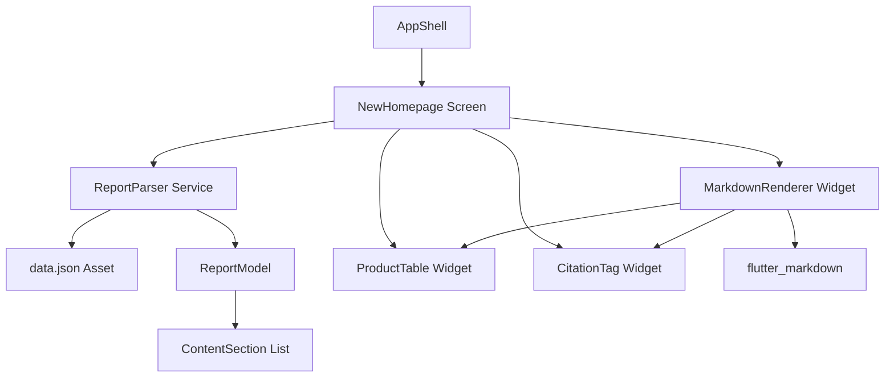
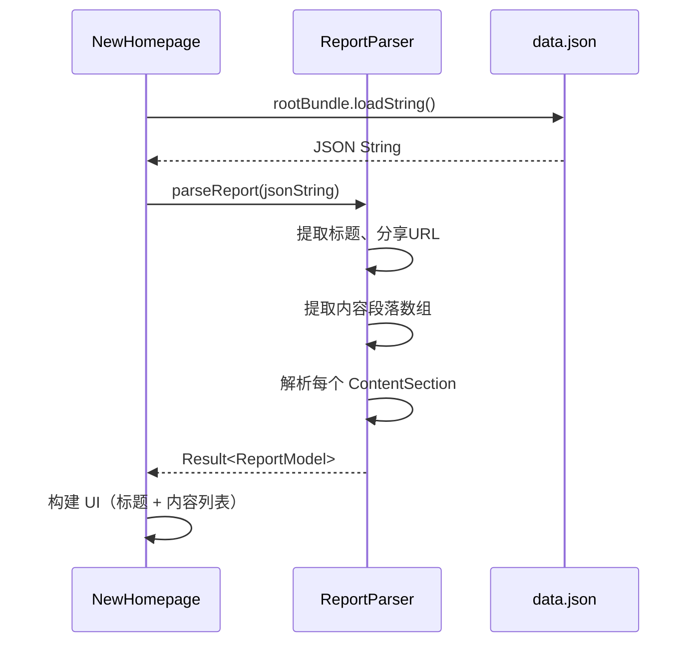

# 技术设计文档：新首页（报告展示页）

## 概述

本设计为 Flutter 电商 Demo 应用实现一个新的首页屏幕（NewHomepage），用于解析本地 `data.json` 文件并以富文本形式展示分析报告内容。

核心功能包括：
- 从 `data.json` 解析嵌套 JSON 结构为类型安全的 Dart 数据模型
- 渲染 Markdown 富文本内容（标题、段落、列表、加粗/斜体）
- 解析并展示产品表格（含图片、价格、销量）
- 处理 `<cite>` 引用来源标签
- 集成到 AppShell 底部导航栏替换原有 HomeScreen

设计决策：
- 使用 `flutter_markdown` 包渲染 Markdown 内容，避免手动解析 Markdown 语法
- 产品表格从 Markdown 文本中提取后使用自定义 Widget 渲染，因为 flutter_markdown 对表格中图片的支持有限
- `<cite>` 标签在 Markdown 渲染前预处理为可识别的内联组件
- ReportParser 作为纯函数服务，不持有状态，便于测试

## 架构



### 数据流



### 关键架构决策

1. **flutter_markdown 包**：选择 `flutter_markdown` 而非手动解析，因为它已经支持标题、段落、列表、加粗/斜体等常见 Markdown 元素，且社区成熟稳定。
2. **产品表格自定义渲染**：Markdown 表格中包含图片 URL 和链接，`flutter_markdown` 的默认表格渲染无法很好地展示图片卡片，因此在 Markdown 渲染前拦截表格内容，使用自定义 `ProductTable` Widget 渲染。
3. **cite 标签预处理**：`<cite>` 不是标准 Markdown 语法，需要在传入 flutter_markdown 前进行预处理，将其转换为可点击的引用标签。
4. **Result 模式错误处理**：ReportParser 返回 `Result` 类型（sealed class），明确区分成功和失败情况，避免异常驱动的控制流。


## 组件与接口

### 1. ReportParser（服务层）

位置：`lib/services/report_parser.dart`

```dart
/// 解析 data.json 的嵌套 JSON 结构为 ReportModel
class ReportParser {
  /// 从 JSON 字符串解析报告数据
  /// 返回 Result<ReportModel>，成功时包含解析后的模型，失败时包含错误描述
  static Result<ReportModel> parseReport(String jsonString);
  
  /// 从 JSON Map 解析报告数据（便于测试）
  static Result<ReportModel> parseReportFromMap(Map<String, dynamic> json);
}
```

### 2. MarkdownContentRenderer（Widget）

位置：`lib/widgets/markdown_content_renderer.dart`

```dart
/// 渲染单个 ContentSection 的 Markdown 内容
/// 自动处理 <cite> 标签和产品表格的拦截
class MarkdownContentRenderer extends StatelessWidget {
  final String markdownText;
  const MarkdownContentRenderer({super.key, required this.markdownText});
}
```

职责：
- 预处理 `<cite>` 标签，转换为 CitationTag Widget
- 检测 Markdown 中的产品表格，拦截并交给 ProductTable 渲染
- 将剩余 Markdown 内容交给 `flutter_markdown` 渲染
- 使用 Theme 中的 textTheme 和 colorScheme

### 3. ProductTable（Widget）

位置：`lib/widgets/product_table.dart`

```dart
/// 以卡片形式展示产品表格数据
class ProductTable extends StatelessWidget {
  final List<ProductTableItem> products;
  const ProductTable({super.key, required this.products});
}
```

### 4. CitationTag（Widget）

位置：`lib/widgets/citation_tag.dart`

```dart
/// 渲染引用来源标签，显示来源名称
class CitationTag extends StatelessWidget {
  final String sourceName;
  final String url;
  const CitationTag({super.key, required this.sourceName, required this.url});
}
```

### 5. NewHomepage（Screen）

位置：`lib/screens/new_homepage.dart`

```dart
/// 新首页屏幕，加载并展示报告内容
class NewHomepage extends StatefulWidget {
  const NewHomepage({super.key});
}
```

状态管理：
- `_loading`：是否正在加载数据
- `_error`：错误信息（null 表示无错误）
- `_report`：解析后的 ReportModel

### 6. ContentSectionParser（工具类）

位置：`lib/services/content_section_parser.dart`

```dart
/// 从 Markdown 文本中分离普通内容和产品表格
class ContentSectionParser {
  /// 将 Markdown 文本拆分为渲染段（普通 Markdown 或产品表格）
  static List<RenderSegment> parse(String markdown);
  
  /// 解析 Markdown 表格文本为 ProductTableItem 列表
  static List<ProductTableItem> parseProductTable(String tableMarkdown);
}
```

## 数据模型

### ReportModel

位置：`lib/models/report_model.dart`

```dart
class ReportModel {
  final String title;        // 报告标题，来自 shareDTO.extra.title
  final String shareUrl;     // 分享链接，来自 shareDTO.shareUrl
  final List<ContentSection> sections;  // 内容段落列表
  
  const ReportModel({
    required this.title,
    required this.shareUrl,
    required this.sections,
  });
  
  /// 序列化为 JSON Map
  Map<String, dynamic> toJson();
  
  /// 从 JSON Map 反序列化
  factory ReportModel.fromJson(Map<String, dynamic> json);
}
```

### ContentSection

```dart
class ContentSection {
  final String contentType;  // 内容类型，如 "summary"
  final String summary;      // Markdown 文本内容
  
  const ContentSection({
    required this.contentType,
    required this.summary,
  });
  
  Map<String, dynamic> toJson();
  factory ContentSection.fromJson(Map<String, dynamic> json);
}
```

### ProductTableItem

位置：`lib/models/product_table_item.dart`

```dart
class ProductTableItem {
  final String title;       // 产品标题
  final String? titleUrl;   // 产品链接
  final String? imageUrl;   // 产品图片 URL
  final String price;       // 价格
  final String salesVolume; // 销量
  final String source;      // 来源平台
  
  const ProductTableItem({
    required this.title,
    this.titleUrl,
    this.imageUrl,
    required this.price,
    required this.salesVolume,
    required this.source,
  });
  
  Map<String, dynamic> toJson();
  factory ProductTableItem.fromJson(Map<String, dynamic> json);
}
```

### Result（密封类）

位置：`lib/models/result.dart`

```dart
sealed class Result<T> {
  const Result();
}

class Success<T> extends Result<T> {
  final T data;
  const Success(this.data);
}

class Failure<T> extends Result<T> {
  final String message;
  const Failure(this.message);
}
```

### RenderSegment（渲染段）

```dart
sealed class RenderSegment {
  const RenderSegment();
}

class MarkdownSegment extends RenderSegment {
  final String markdown;
  const MarkdownSegment(this.markdown);
}

class ProductTableSegment extends RenderSegment {
  final List<ProductTableItem> products;
  const ProductTableSegment(this.products);
}
```

### 新增依赖

需要在 `pubspec.yaml` 中添加：

```yaml
dependencies:
  flutter_markdown: ^0.7.6  # Markdown 渲染
  url_launcher: ^6.3.1      # 打开引用来源链接
```

需要在 `pubspec.yaml` 的 `flutter.assets` 中注册：

```yaml
flutter:
  assets:
    - lib/models/data.json
```


## 正确性属性

*属性（Property）是指在系统所有有效执行中都应成立的特征或行为——本质上是对系统应做什么的形式化陈述。属性是人类可读规格说明与机器可验证正确性保证之间的桥梁。*

### 属性 1：JSON 解析正确性

*对于任意*有效的 JSON 结构（包含 `data.data.shareDTO.extra.title` 路径的标题字符串、`data.data.shareDTO.shareUrl` 路径的分享 URL、以及 `data.data.msgHistoryRoundVersionDTO.rounds[0].messages[0].content[0].data` 路径下包含若干 `contentType: "summary"` 元素的数组），ReportParser 解析后生成的 ReportModel 应满足：标题与原始 JSON 中的标题一致，内容段落数量等于原始数组中 `contentType` 为 `"summary"` 的元素数量，且段落顺序与原始数组中的顺序一致。

**验证需求：1.1, 1.2, 1.3, 5.2**

### 属性 2：无效 JSON 返回失败结果

*对于任意*不符合预期嵌套结构的 JSON 字符串（如缺少必要的键路径、值类型错误、或非法 JSON），ReportParser 应返回一个 Failure 结果，且该结果包含非空的错误描述字符串。

**验证需求：1.4**

### 属性 3：ReportModel 序列化往返

*对于任意*有效的 ReportModel 对象（包含任意非空标题、任意分享 URL、以及任意长度的 ContentSection 列表），将其通过 `toJson()` 序列化为 JSON Map 再通过 `fromJson()` 反序列化，应产生与原始对象等价的 ReportModel。

**验证需求：1.6**

### 属性 4：Cite 标签提取

*对于任意*包含 `<cite>[来源名称](URL)</cite>` 模式的 Markdown 文本，cite 标签预处理器应正确提取所有引用来源的名称和 URL，且提取的数量等于原始文本中 `<cite>` 标签的数量。

**验证需求：2.4**

### 属性 5：产品表格解析

*对于任意*包含 Product Title、Image、Price、Sales Volume、Source 列的 Markdown 表格文本，ContentSectionParser 解析后生成的 ProductTableItem 列表应满足：列表长度等于表格数据行数，且每个 ProductTableItem 的 title、price、salesVolume、source 字段与原始表格对应行的数据一致。

**验证需求：3.1**

## 错误处理

### JSON 解析错误

| 错误场景 | 处理方式 |
|---------|---------|
| JSON 字符串格式非法 | ReportParser 返回 `Failure`，包含 "Invalid JSON format" 描述 |
| 缺少 `data.data` 路径 | ReportParser 返回 `Failure`，包含具体缺失路径描述 |
| `rounds` 数组为空 | ReportParser 返回 `Failure`，包含 "No content rounds found" 描述 |
| `content` 数组为空 | ReportParser 返回 `Failure`，包含 "No content data found" 描述 |
| `shareDTO.extra.title` 缺失 | ReportParser 返回 `Failure`，包含 "Missing report title" 描述 |

### Asset 加载错误

| 错误场景 | 处理方式 |
|---------|---------|
| `data.json` 文件不存在或无法读取 | NewHomepage 展示错误信息和重试按钮 |
| 网络图片加载失败 | ProductTable 展示 `Icons.image_not_supported` 占位图标 |

### UI 状态管理

```
加载中 → 成功（展示报告内容）
加载中 → 失败（展示错误信息 + 重试按钮）
失败 → 点击重试 → 加载中
```

## 测试策略

### 属性测试（Property-Based Testing）

使用 `dart_quickcheck` 或手动实现的随机生成器配合 `flutter_test`，每个属性测试至少运行 100 次迭代。

由于 Dart/Flutter 生态中成熟的 PBT 库有限，采用以下策略：
- 使用 `dart:math` 的 `Random` 类生成随机测试数据
- 编写自定义生成器（Generator）为每个数据模型生成随机实例
- 在 `flutter_test` 框架中循环运行 100+ 次

每个属性测试必须标注对应的设计属性：

```dart
// Feature: new-homepage, Property 1: JSON 解析正确性
test('ReportParser correctly parses valid JSON structures', () {
  for (var i = 0; i < 100; i++) {
    // 生成随机有效 JSON → 解析 → 验证
  }
});

// Feature: new-homepage, Property 2: 无效 JSON 返回失败结果
test('ReportParser returns Failure for invalid JSON', () {
  for (var i = 0; i < 100; i++) {
    // 生成随机无效 JSON → 解析 → 验证返回 Failure
  }
});

// Feature: new-homepage, Property 3: ReportModel 序列化往返
test('ReportModel serialization round-trip', () {
  for (var i = 0; i < 100; i++) {
    // 生成随机 ReportModel → toJson → fromJson → 验证等价
  }
});

// Feature: new-homepage, Property 4: Cite 标签提取
test('Cite tag extraction preserves all sources', () {
  for (var i = 0; i < 100; i++) {
    // 生成随机 markdown + cite 标签 → 提取 → 验证数量和内容
  }
});

// Feature: new-homepage, Property 5: 产品表格解析
test('Product table parsing extracts all rows correctly', () {
  for (var i = 0; i < 100; i++) {
    // 生成随机产品数据 → 格式化为 markdown 表格 → 解析 → 验证
  }
});
```

### 单元测试

单元测试聚焦于具体示例和边界情况，与属性测试互补：

- **ReportParser**：使用实际 `data.json` 内容验证解析结果的具体字段值
- **ContentSectionParser**：验证空表格、单行表格、缺少列的表格等边界情况
- **ProductTableItem**：验证图片 URL 为空、价格格式异常等边界情况
- **Cite 标签**：验证嵌套 cite、空 URL、特殊字符等边界情况

### Widget 测试

- **NewHomepage**：验证加载状态显示 CircularProgressIndicator
- **NewHomepage**：验证错误状态显示错误信息和重试按钮
- **NewHomepage**：验证成功状态显示报告标题
- **ProductTable**：验证图片加载失败时显示占位图标
- **MarkdownContentRenderer**：验证基本 Markdown 元素渲染

### 测试文件结构

```
test/
  services/
    report_parser_test.dart          # 属性测试 + 单元测试
    content_section_parser_test.dart  # 属性测试 + 单元测试
  models/
    report_model_test.dart           # 属性测试（往返）+ 单元测试
  widgets/
    product_table_test.dart          # Widget 测试
    citation_tag_test.dart           # 属性测试 + Widget 测试
    markdown_content_renderer_test.dart # Widget 测试
  screens/
    new_homepage_test.dart           # Widget 测试
```
